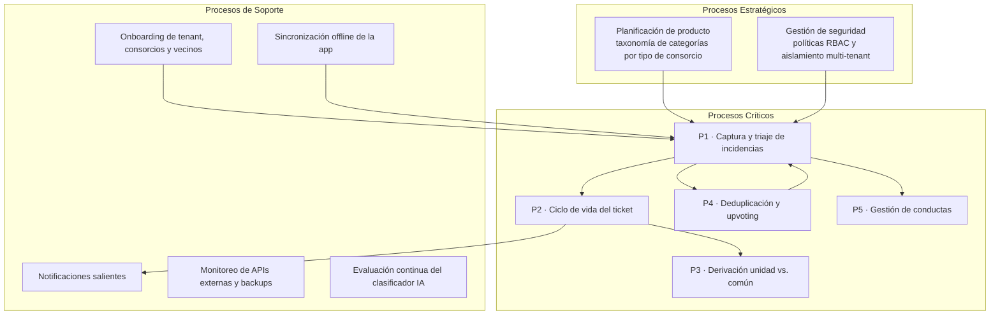
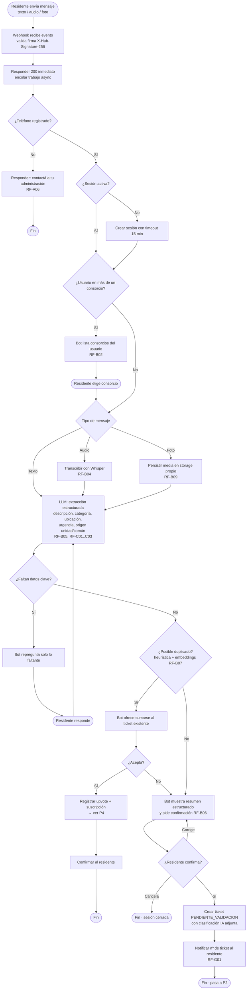
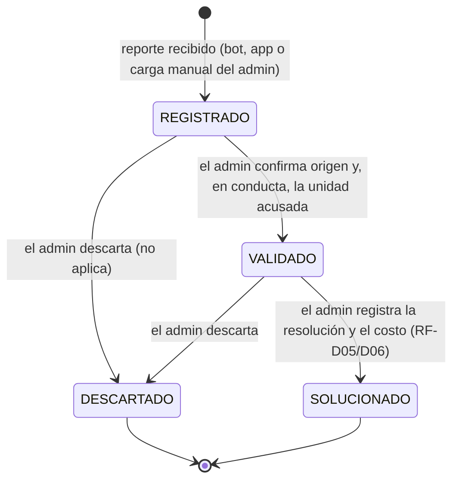
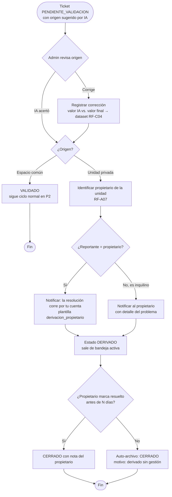
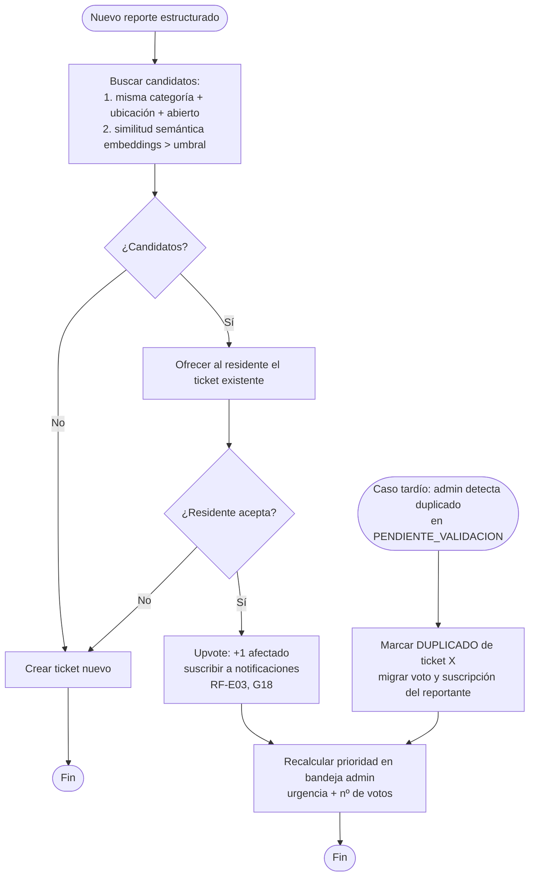
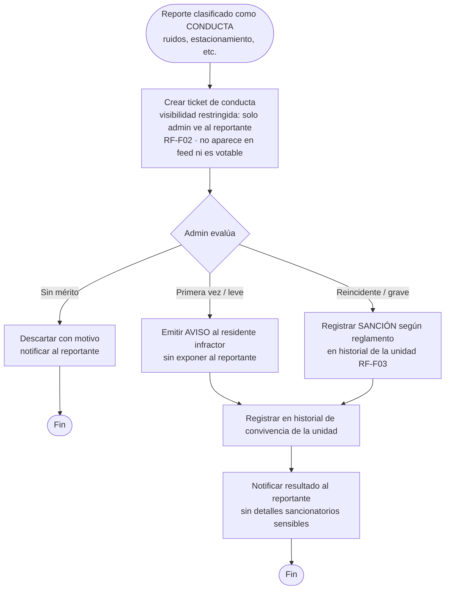
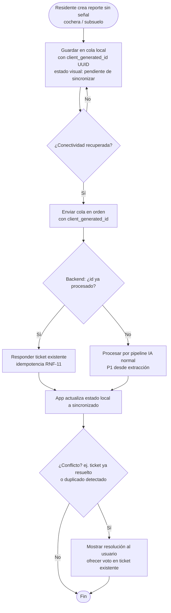
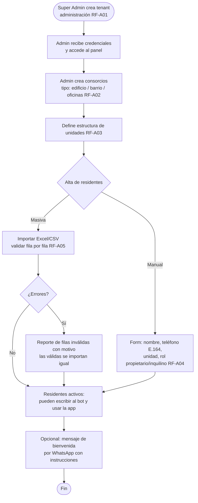
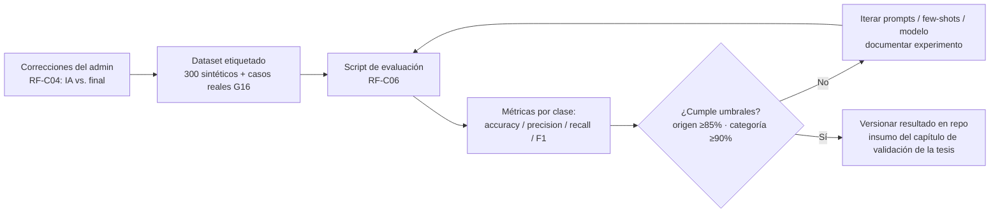

# ConsorcioFix — Modelado de Procesos (BPMN)

> Los diagramas están en **Mermaid** para que rendericen directo en GitHub y sean parseables por Claude Code. Cada proceso indica sus *lanes* (responsables) al estilo BPMN; los subgrafos representan pools/lanes. Los procesos están alineados al mapa del Sprint 0: **estratégicos**, **críticos** y **de soporte**.

---

## Mapa global de procesos



---

## P1 — Captura y triaje de incidencias vía WhatsApp (proceso crítico nº1)

**Lanes:** Residente · WhatsApp Cloud API · Servicio de Mensajería · Pipeline IA · Sistema (dominio)

**Disparador:** el residente envía texto/audio/foto al número del bot.
**Resultado:** ticket creado en estado `PENDIENTE_VALIDACION` (o voto sumado a ticket existente), con confirmación al residente en < 60 s.



**Reglas de negocio:**
- El webhook siempre responde 200 rápido; el procesamiento es asíncrono (cola). Reintentos de Meta no duplican (idempotencia por `wamid`, RNF-11).
- Si Whisper o el LLM fallan: el reporte queda encolado con reintentos; si persiste, el bot pide el reporte en texto y el ticket se crea sin clasificación con flag `REVISION_MANUAL` (RNF-06).
- Confianza del clasificador < umbral → flag `BAJA_CONFIANZA` visible para el admin (RF-C01).

---

## P2 — Ciclo de vida del ticket (máquina de estados)

> **Actualizado el 2026-08-18.** La máquina de nueve estados que describía esta sección quedó superada por la decisión del 2026-06-12, registrada en [ADR-002](adr/ADR-002-ciclo-de-vida-del-ticket.md). El diagrama original se conserva más abajo, tachado, porque el Ante Proyecto lo cita y conviene que sea trazable qué se cambió y por qué.

**Lanes:** Sistema · Administrador · Residente *(el técnico está fuera del sistema — ver ADR-002)*



**Invariantes:**
- Las transiciones SOLO pasan por `packages/domain/src/ticket/transitions.ts` (regla 2 de CLAUDE.md). Hay un único `update` de `estado` en todo el código y está precedido por `assertTransition`.
- Toda transición registra autor, timestamp y nota → historial auditable en `ticket_evento`, consultable en `GET /tickets/:id/historial` (RF-D02, RF-H05).
- Solo el ADMIN ejecuta transiciones.
- `VALIDADO` exige que el admin confirme el `origen`, porque de eso depende la visibilidad. En un ticket de CONDUCTA exige además la `unidad_reportada_id` (RF-F01), respaldado por un CHECK en la base.
- **No hay reapertura.** Si el problema reaparece se crea un ticket nuevo: dos ocurrencias del mismo caño roto son dos incidencias, y así el tiempo de resolución de cada una se mide sin contaminar.
- Cada transición relevante dispara una notificación (P-S3, RF-G01).

### Diagrama original (superado — se conserva por trazabilidad)

<details>
<summary>Máquina de nueve estados del Ante Proyecto</summary>

Superada por ADR-002. Los estados `ASIGNADO` y `EN_REPARACION` presuponían que el técnico usa el sistema, y no lo usa: el admin lo contacta por afuera. Modelar estados que nadie transiciona producía tickets colgados para siempre esperando a un actor inexistente.

```
[*] --> NUEVO --> EN_TRIAJE --> PENDIENTE_VALIDACION
PENDIENTE_VALIDACION --> (VALIDADO | DERIVADO | RECHAZADO | DUPLICADO)
VALIDADO --> ASIGNADO --> EN_REPARACION --> RESUELTO --> CERRADO
CERRADO --> PENDIENTE_VALIDACION  (reapertura)
```

</details>

---

## P3 — Decisión y derivación: unidad privada vs. espacio común

**Lanes:** Pipeline IA · Administrador · Sistema · Propietario



---

## P4 — Deduplicación y upvoting

**Lanes:** Pipeline IA · Residente · Administrador · Sistema



**Regla:** la IA nunca fusiona sola; el merge lo decide el residente (al reportar) o el admin (en validación) — G14.

---

## P5 — Gestión de incidencias de conducta

**Lanes:** Residente reportante · Pipeline IA · Administrador · Residente reportado



---

## P6 — Sincronización offline de la app (soporte)

**Lanes:** Residente · App móvil · Backend



---

## P7 — Onboarding de tenant, consorcios y vecinos (soporte)

**Lanes:** Super Admin · Administrador · Sistema · Residente



---

## P8 — Evaluación continua del clasificador (soporte / calidad IA)


