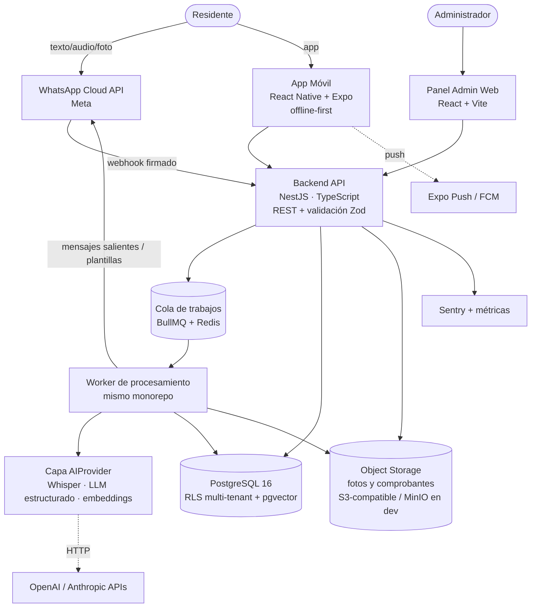
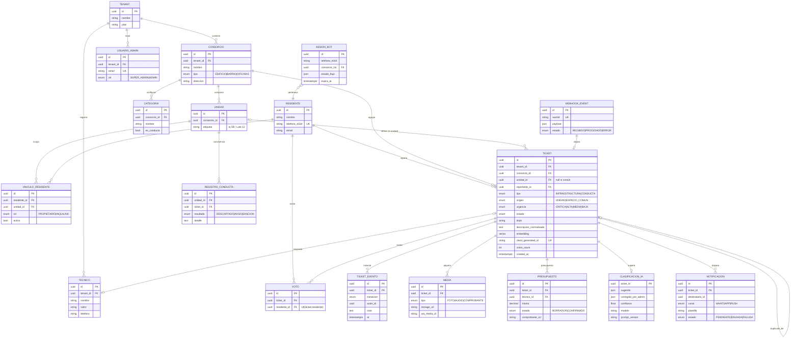
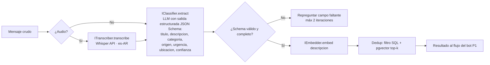

# ConsorcioFix — Arquitectura y Modelo de Datos

> Propuesta técnica de referencia para arrancar el desarrollo con Claude Code. Implementa las decisiones G2 (stack TS), G12 (tenant = administración), G14 (dedup), G15 (offline) y G17 (abstracción IA). Todo es ajustable, pero esta es la línea base coherente con el Ante Proyecto.

---

## 1. Vista de contenedores (C4 nivel 2)



**Decisiones clave:**

1. **Monorepo TypeScript** (pnpm workspaces o Turborepo):
   ```
   /apps
     /api          → NestJS (REST, auth, RBAC, webhooks)
     /worker       → procesamiento async (IA, notificaciones)
     /admin-web    → React + Vite (panel)
     /mobile       → React Native + Expo
   /packages
     /domain       → entidades, máquina de estados del ticket, reglas puras
     /contracts    → tipos compartidos + schemas Zod (API y eventos)
     /ai           → AIProvider: ITranscriber, IClassifier, IEmbedder
     /messaging    → IMessagingProvider (WhatsApp Cloud hoy; Twilio/360dialog mañana)
   ```
2. **Webhook fire-and-forget:** el endpoint de Meta valida firma, persiste el evento crudo (tabla `webhook_events`, idempotencia por `wamid`) y responde 200. Todo lo demás pasa por BullMQ (RNF-03, RNF-11).
3. **Abstracciones por riesgo** (del análisis de riesgos del Ante Proyecto): `IMessagingProvider` y `AIProvider` como puertos; los adaptadores concretos viven en `/packages`. Cambiar proveedor = cambiar binding + env vars.
4. **RLS por tenant:** cada request setea `SET LOCAL app.tenant_id = $1` en la transacción; políticas RLS en todas las tablas tenant-scoped. El usuario de DB de la app **no** es owner de las tablas (RLS no aplica a owners). Tests de aislamiento dedicados (RF-H02).
5. **Dedup semántico:** `pgvector` con embedding de la descripción normalizada; índice ivfflat; filtro previo por consorcio + categoría + estado abierto (G14) para que la búsqueda vectorial sea barata.
6. **Offline app:** cola local persistente (SQLite vía expo-sqlite o WatermelonDB) con `client_generated_id` UUID v4 generado en el dispositivo; el backend hace upsert idempotente (G15).

## 2. Modelo de datos (ERD)



**Notas del modelo:**
- `VINCULO_RESIDENTE` es la pieza que resuelve "propietario e inquilino diferenciados por unidad" (RF-A04/A07) y "usuario en múltiples consorcios" (el bot lista los consorcios derivados de sus vínculos activos, RF-B02).
- `TICKET.unidad_id` nullable: null = espacio común. `origen` lo sugiere la IA y lo confirma el admin.
- `CLASIFICACION_IA` guarda sugerido vs. corregido + versión de prompt y modelo → dataset de mejora (RF-C04, G16) y material de tesis.
- `votos_count` desnormalizado para ordenar la bandeja sin agregaciones costosas; consistencia por trigger o en el servicio.
- Todas las tablas tenant-scoped llevan `tenant_id` (directo o derivable) y política RLS `tenant_id = current_setting('app.tenant_id')::uuid`.

## 3. Contratos clave (resumen)

| Endpoint / evento | Descripción |
|---|---|
| `POST /webhooks/whatsapp` | Recepción Meta. Valida firma, persiste `webhook_event`, encola, responde 200. |
| `GET /webhooks/whatsapp` | Verificación del challenge de Meta (setup). |
| `POST /tickets` (app) | Crea reporte desde app. Acepta `client_generated_id`; idempotente. |
| `POST /tickets/:id/votes` | Upvote (único por residente). |
| `POST /tickets/:id/transitions` | Transición de estado (solo ADMIN, valida máquina de estados en `/packages/domain`). |
| `POST /tickets/:id/budgets` | Alta de presupuesto/costo. |
| `POST /consorcios/:id/residents/import` | Importación Excel/CSV con reporte de errores. |
| Job `process-incoming-message` | Orquesta P1: sesión → transcripción → extracción → dedup → confirmación. |
| Job `send-notification` | Salientes con plantilla; maneja ventana 24h y reintentos. |
| Job `evaluate-classifier` | Corre dataset etiquetado y emite métricas (RF-C06). |

## 4. Pipeline de IA (detalle)



- **Prompts versionados** en `/packages/ai/prompts/*.md` con changelog — cada cambio de prompt es un experimento medible con el script de evaluación (P8).
- **Criterios de urgencia** explícitos en el prompt (riesgo a personas > daño progresivo > confort), para cumplir la promesa del pitch de "perito objetivo".
- **Costo por ticket** trackeado: tokens in/out por llamada en tabla de telemetría (RF-C07).

## 5. Entornos y despliegue

| Entorno | Infra | Notas |
|---|---|---|
| **dev local** | Docker Compose: postgres+pgvector, redis, minio, mailhog, mock de WhatsApp y mock de IA | `docker compose up` y a programar. Los mocks permiten desarrollar sin gastar API ni exponer webhooks. Para probar Meta real: túnel (ngrok/cloudflared). |
| **staging** | VPS barato o Fly.io/Railway con contenedores; DB administrada o en el mismo VPS | Deploy automático desde `main` tras CI verde. Smoke E2E post-deploy. |
| **piloto/prod** | Igual que staging con aprobación manual | Sentry + backups diarios de Postgres (proceso de soporte del Sprint 0). |

## 6. Seguridad (síntesis operable)

1. JWT corto + refresh; hash Argon2id; rate limiting en auth y webhook.
2. RLS en Postgres + tests de aislamiento que intentan leer datos cruzados con tokens de otro tenant (deben fallar) — riesgo crítico del Ante Proyecto.
3. RBAC en guards de NestJS con matriz declarativa testeada (RF-H01/H03).
4. Validación de firma del webhook; secrets solo por env; `npm audit`/Snyk en CI; ZAP baseline scan pre-piloto (RNF-04).
5. Datos personales: minimización y consentimiento (Ley 25.326) — documentar en tesis (RNF-05).
