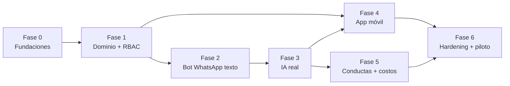

# ConsorcioFix — Plan de Desarrollo con Claude Code

> Plan operativo por fases, pensado para ejecutarse con **Claude Code**. Indica qué modelo conviene en cada tarea (**Opus** para diseño/arquitectura/lógica delicada; **Sonnet** para scaffolding, CRUDs, tests y UI), el orden de dependencias y los criterios de salida de cada fase. Las fases mapean al cronograma del Ante Proyecto.

---

## 0. Cómo trabajar con Claude Code en este proyecto

**Reglas de oro:**

1. **Estos docs van al repo** (`/docs`). Claude Code los lee como contexto: en cada sesión, referenciá el doc relevante ("implementá P1 según docs/03-procesos-bpmn.md").
2. **`CLAUDE.md` en la raíz** (incluido en este paquete) define stack, convenciones, comandos y límites. Claude Code lo lee automáticamente.
3. **Una fase = una secuencia de PRs chicos.** No pidas "hacé el backend"; pedí "implementá RF-A02 con sus tests". El Definition of Done del Ante Proyecto aplica a cada PR.
4. **Opus vs. Sonnet, criterio práctico:**
   - **Opus:** decisiones de arquitectura, diseño de la máquina de estados, políticas RLS, motor de sync offline, diseño de prompts del clasificador, debugging difícil, revisión de seguridad. Todo lo que, si sale mal, cuesta caro corregir.
   - **Sonnet:** generar módulos NestJS a partir de specs ya decididas, CRUDs, DTOs/Zod, tests unitarios y de integración, componentes React/RN, seeds, documentación, migraciones rutinarias.
   - Patrón recomendado: **diseñar con Opus → guardar la decisión en `/docs/adr/` → implementar con Sonnet → revisar lo crítico con Opus.**
5. **Plan mode primero:** ante tareas grandes, pedile a Claude Code que proponga el plan antes de tocar código, y revisalo contra estos docs.
6. **TDD donde duele:** máquina de estados, RBAC, RLS, dedup e idempotencia se desarrollan tests-first. Es la forma más barata de cumplir el 70% de cobertura en módulos críticos.

---

## Fase 0 — Fundaciones del repo (1–2 semanas)

**Objetivo:** monorepo levantando con `docker compose up`, CI verde, esquema base migrado.

| # | Tarea | Modelo | Entregable |
|---|---|---|---|
| 0.1 | Inicializar monorepo (pnpm + Turborepo): `apps/api`, `apps/worker`, `apps/admin-web`, `apps/mobile`, `packages/{domain,contracts,ai,messaging}` | Sonnet | Estructura + tsconfig/eslint/prettier compartidos |
| 0.2 | Docker Compose dev: postgres16+pgvector, redis, minio, mock-whatsapp, mock-ai | Sonnet | `docker compose up` funcional |
| 0.3 | CI GitHub Actions: lint → typecheck → unit → integración (Testcontainers) → build; branch protection en `main` | Sonnet | Pipeline verde + PR template con checklist DoD |
| 0.4 | **Diseño fino del esquema** a partir del ERD (docs/04): revisar índices, RLS, constraints | **Opus** | ADR-001 (esquema y tenancy) + migraciones iniciales (Prisma o Drizzle — decidir en esta tarea) |
| 0.5 | Seeds de desarrollo: 1 tenant, 2 consorcios, 30 unidades, 40 residentes, taxonomía base | Sonnet | `pnpm seed` |

**Criterio de salida:** clonar el repo + `docker compose up` + `pnpm seed` deja un entorno operable; CI bloquea PRs rotos.

**Prompt inicial sugerido (Opus, plan mode):**
> "Leé docs/01 a 04 y CLAUDE.md. Proponé el plan de la Fase 0 del docs/05: estructura exacta del monorepo, elección Prisma vs Drizzle considerando que necesitamos RLS con `SET LOCAL app.tenant_id` por transacción y pgvector, y el diseño de las migraciones iniciales del ERD de docs/04 §2. No escribas código todavía; quiero el plan y los trade-offs."

---

## Fase 1 — Núcleo de dominio: tenancy, RBAC, tickets (3–4 semanas)

**Objetivo:** el corazón del sistema sin canales todavía: entidades, RLS, máquina de estados, API y panel mínimo.

| # | Tarea | Modelo | RFs |
|---|---|---|---|
| 1.1 | **Diseño RLS + contexto de tenant por request** (interceptor NestJS que setea `app.tenant_id`) y suite de tests de aislamiento | **Opus** | RF-H02 |
| 1.2 | Auth (JWT + refresh, Argon2id) y RBAC con matriz declarativa + guards | Opus diseño / Sonnet implementación | RF-H01, H03, H04 |
| 1.3 | CRUDs: tenant, consorcios, unidades, residentes, vínculos, técnicos, categorías | Sonnet | RF-A01..A04, A07, D07 |
| 1.4 | Importación masiva Excel/CSV con validación fila a fila | Sonnet | RF-A05 |
| 1.5 | **Máquina de estados del ticket** en `packages/domain` (pura, sin framework) — TDD contra P2 de docs/03 | **Opus** | RF-D02, G13 |
| 1.6 | API de tickets: creación interna, transiciones, historial, votos, presupuestos | Sonnet | RF-D01..D06, RF-E03 |
| 1.7 | Panel admin v1: login, bandeja con filtros, detalle de ticket con transiciones, ABMs | Sonnet | RF-D01, D02 |
| 1.8 | Auditoría de acciones sensibles | Sonnet | RF-H05 |

**Criterio de salida:** un admin puede (vía panel) cargar su consorcio, crear un ticket manual y llevarlo de `PENDIENTE_VALIDACION` a `CERRADO` con costos; los tests de aislamiento multi-tenant pasan; cobertura ≥70% en `domain`.

---

## Fase 2 — Canal WhatsApp con sesiones (texto primero) (3 semanas)

**Objetivo:** P1 funcionando end-to-end con mensajes de texto, sin IA real todavía (clasificación mockeada).

| # | Tarea | Modelo | RFs |
|---|---|---|---|
| 2.1 | **Diseño de `IMessagingProvider`** + adaptador WhatsApp Cloud + mock local; webhook con firma e idempotencia por `wamid`; cola BullMQ | **Opus** | RF-B01, RNF-03, RNF-11 |
| 2.2 | **Motor de sesiones del bot** (estado persistido, timeout, flujo multi-mensaje) y resolución multi-consorcio | **Opus** | RF-B02, B03 |
| 2.3 | Flujo conversacional de reporte por texto: repreguntas, resumen, confirmación → ticket | Sonnet | RF-B05 (mock), B06 |
| 2.4 | Manejo de no registrados y comando de estado | Sonnet | RF-A06, B10 |
| 2.5 | Descarga y persistencia de media de Meta (fotos) | Sonnet | RF-B09 |
| 2.6 | Notificaciones salientes: job `send-notification`, plantillas HSM (definir y registrar en Meta Business), ventana 24h | Opus diseño / Sonnet implementación | RF-G01, G02 |
| 2.7 | E2E del flujo con mock: mensaje → ticket visible en panel → transición → notificación | Sonnet | — |

**Criterio de salida:** demo reproducible: escribís al bot (mock o número de prueba de Meta), confirmás el reporte, aparece en la bandeja, lo resolvés y te llega la notificación. **Esta demo ya sirve para mostrar avance a la cátedra.**

---

## Fase 3 — Pipeline de IA real (3–4 semanas)

**Objetivo:** reemplazar mocks por Whisper + LLM + dedup, con evaluación medible.

| # | Tarea | Modelo | RFs |
|---|---|---|---|
| 3.1 | **Diseño de `AIProvider`** (ITranscriber/IClassifier/IEmbedder), salida estructurada con JSON Schema, manejo de fallos y reintentos | **Opus** | RF-C05, RNF-06 |
| 3.2 | **Generación del dataset sintético etiquetado** (~300 casos es-AR: textos y audios TTS, etiquetas origen/categoría/urgencia) | **Opus** (calidad del dataset importa) | G16 |
| 3.3 | **Diseño y iteración de prompts** del extractor/clasificador con criterios de urgencia objetivos; versionado en `/packages/ai/prompts` | **Opus** | RF-C01..C03 |
| 3.4 | Script de evaluación (accuracy/precision/recall/F1 por clase) en CI | Sonnet | RF-C06 |
| 3.5 | Integración Whisper en el flujo de audio del bot | Sonnet | RF-B04 |
| 3.6 | Dedup: embeddings + pgvector + heurística + flujo de oferta de voto en el bot | Opus diseño / Sonnet implementación | RF-B07, G14 |
| 3.7 | Registro de correcciones del admin (sugerido vs. final) y panel de revisión de baja confianza | Sonnet | RF-C04 |
| 3.8 | Telemetría de costo IA por ticket + caché | Sonnet | RF-C07 |

**Criterio de salida:** métricas del clasificador documentadas (≥85% origen, ≥90% categoría sobre el dataset); audio → ticket clasificado en <15 s; duplicado obvio → oferta de voto. **Capítulo de validación de la tesis prácticamente escrito.**

---

## Fase 4 — App móvil con offline (3–4 semanas)

| # | Tarea | Modelo | RFs |
|---|---|---|---|
| 4.1 | App Expo: auth, navegación, feed de comunes con votos y costos, detalle con timeline | Sonnet | RF-E01, E02, E06 |
| 4.2 | Creación de reportes desde app (texto/foto) por el pipeline común | Sonnet | RF-E04 |
| 4.3 | **Motor offline:** cola local persistente, `client_generated_id`, reintentos, estados visuales, resolución de conflictos | **Opus** | RF-E05, RNF-11 |
| 4.4 | Upvote + suscripción + push (Expo Push) | Sonnet | RF-E03, E07, G03 |
| 4.5 | E2E móvil de los flujos núcleo (Maestro) incluyendo escenario modo avión | Sonnet | — |

**Criterio de salida:** demo en subsuelo real (o modo avión): reportás sin señal, salís, sincroniza sin duplicar.

---

## Fase 5 — Conductas + costos visibles + métricas (2 semanas)

| # | Tarea | Modelo | RFs |
|---|---|---|---|
| 5.1 | Flujo de conducta end-to-end con anonimato y registro de avisos/sanciones (P5) | Sonnet (diseño ya está en docs) | RF-F01..F03 |
| 5.2 | Visibilidad de costos confirmados en feed/app según reglas G10 | Sonnet | RF-D05, E02 |
| 5.3 | Tablero de métricas del admin | Sonnet | RF-D08 |

---

---

## Estado real al 2026-08-18

Verificado ejecutando, no leyendo. Lo que sigue vale más que las tildes de las tablas de arriba.

| Fase | Estado | Qué falta concretamente |
|---|---|---|
| 0 — Fundaciones | ✅ | Branch protection en `main` (tarea 0.3) nunca se configuró |
| 1 — Dominio, RBAC, tickets | ✅ | Nada de alcance vigente. RF-D03/D04/D07 superados por ADR-002 |
| 2 — WhatsApp texto | 🟡 | Falta el paso de resumen+confirmación (RF-B06), la ventana de 24 h y las plantillas HSM versionadas (RF-G02). Las notificaciones salen fire-and-forget, sin cola |
| 3 — IA real | 🟡 | **Solo falta poner la API key.** Dataset de 302 casos, `ai:eval` con umbrales y persistencia de sugerencias listos. Quedan el panel de baja confianza (3.7) y la telemetría de costo (3.8) |
| 4 — App móvil | 🟡 | Push notifications (`expo-notifications` no está ni en dependencias) y E2E Maestro. La app tampoco muestra `costosConfirmados` |
| 5 — Conductas y costos | ✅ | Nada. RF-F01 cerrado con la opción A |
| 6 — Hardening | ❌ | Sin arrancar, salvo el gate de cobertura y el upgrade de drizzle que ya se hicieron |

**Canales de bot:** además de WhatsApp hay Telegram, los dos detrás de `IMessagingProvider`. Telegram no necesita verificación de Meta Business ni plantillas aprobadas, así que conviene para desarrollar.

**Lo que más conviene atacar ahora**, en orden: la key de IA y su corrida de `ai:eval` (desbloquea el capítulo de validación), la cobertura de `bot` (10 %) y `webhooks` (16 %), y la cola de notificaciones.

---

## Fase 6 — Endurecimiento y piloto (3 semanas)

| # | Tarea | Modelo | RFs |
|---|---|---|---|
| 6.1 | Carga y performance: k6 sobre webhook y bandeja con datos sintéticos masivos | Sonnet | RNF-01, RNF-02 |
| 6.2 | **Revisión de seguridad:** repaso RLS/RBAC, ZAP baseline, npm audit, revisión manual de los guards con Opus | **Opus** | RNF-04 |
| 6.3 | Observabilidad: Sentry, dashboards de métricas de negocio | Sonnet | RNF-08 |
| 6.4 | Suite E2E smoke post-deploy + despliegue staging→piloto con aprobación manual | Sonnet | — |
| 6.5 | Onboarding del consorcio piloto real (datos reales, plantillas aprobadas en Meta, número productivo) | — (humano) | — |
| 6.6 | Recolección de casos reales → re-evaluación del clasificador → métricas finales para la tesis | Sonnet | G16, P8 |

---

## Dependencias entre fases

*(Fase 4 puede arrancar en paralelo a la 3 si se reparten: uno en backend/IA y otro en mobile — son 2 integrantes.)*

## Backlog de decisiones pendientes (confirmar antes de cada fase)

| Decisión | Cuándo | Default propuesto |
|---|---|---|
| Confirmar stack TS único (cerrar G2) y corregir Ante Proyecto | Ya | TypeScript end-to-end |
| ORM: Prisma vs. Drizzle (interacción con RLS) | Fase 0.4 | Evaluar con Opus; Drizzle suele convivir mejor con `SET LOCAL` |
| NestJS vs. Fastify puro | Fase 0.1 | NestJS (estructura para 2 devs + guards RBAC) |
| Proveedor LLM para clasificación | Fase 3.1 | Empezar con uno, comparar con el script de evaluación |
| N días de auto-archivo de derivados | Fase 1.5 | 30 días |
| Hosting de staging/piloto | Fase 6 | VPS + Docker o Fly.io |
